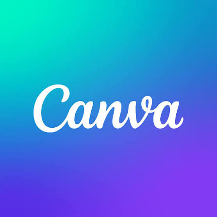

<h1 align="center">
  
</h1>

<h1 align="center">Software Engineer (ML & Full-Stack) </h1>

✨ Focused on Data Systems, Frontend-Backend Robustness, and Edge Computing ✨

  
  

## 🧠 Core Focus & Bio

- CS student focused on Frontend,Backend and ML pipelines  
- Interested in **Frontend Engineering & ML**
- Exploring **Java, Spring Boot, Python, Flask, Javascript**
- Experienced in leveraging Generative AI tools (ChatGPT, Claude, Gemini, GitHub Copilot) for development, debugging, and research workflows
- Open to collaborative projects

## 🛠 My Technical Arsenal

### Languages & Frameworks

### Frontend 

### Tools & Platforms 

### Databases

### Design 

## 📊 GitHub Performance

